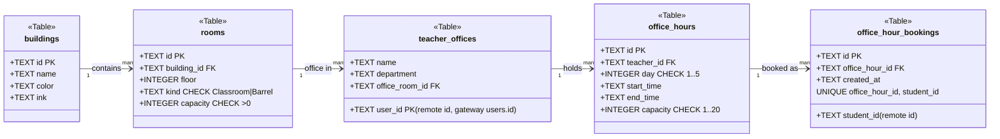

# Database UML: `campus.db`

```mermaid
classDiagram
    direction LR
    class buildings {
        <<Table>>
        +TEXT id PK
        +TEXT name
        +TEXT color
        +TEXT ink
    }
    class rooms {
        <<Table>>
        +TEXT id PK
        +TEXT building_id FK
        +INTEGER floor
        +TEXT kind CHECK Classroom|Barrel
        +INTEGER capacity CHECK >0
    }
    class teacher_offices {
        <<Table>>
        +TEXT user_id PK  (remote id, gateway users.id)
        +TEXT name
        +TEXT department
        +TEXT office_room_id FK
    }
    class office_hours {
        <<Table>>
        +TEXT id PK
        +TEXT teacher_id FK
        +INTEGER day CHECK 1..5
        +TEXT start_time
        +TEXT end_time
        +INTEGER capacity CHECK 1..20
    }
    class office_hour_bookings {
        <<Table>>
        +TEXT id PK
        +TEXT office_hour_id FK
        +TEXT student_id  (remote id)
        +TEXT created_at
        UNIQUE office_hour_id, student_id
    }
    buildings "1" --> "many" rooms : contains
    rooms "1" --> "many" teacher_offices : office in
    teacher_offices "1" --> "many" office_hours : holds
    office_hours "1" --> "many" office_hour_bookings : booked as
```

Timetable lessons are **not** stored: they come from the legacy system through the adapter.
