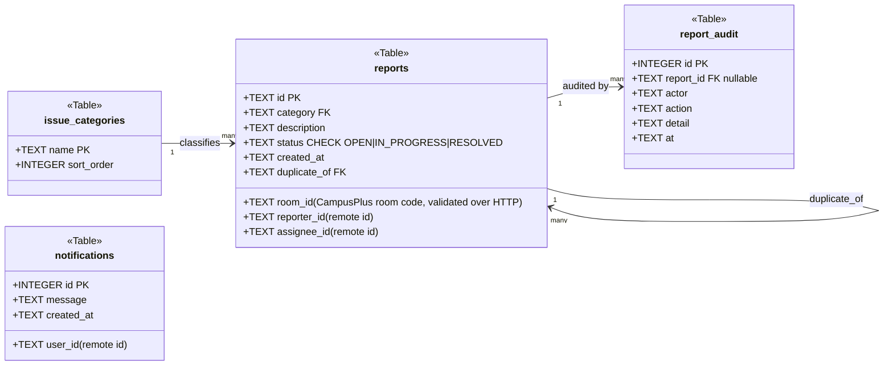

# Database UML: `issues.db`

```mermaid
classDiagram
    direction LR
    class issue_categories {
        <<Table>>
        +TEXT name PK
        +INTEGER sort_order
    }
    class reports {
        <<Table>>
        +TEXT id PK
        +TEXT room_id  (CampusPlus room code, validated over HTTP)
        +TEXT category FK
        +TEXT description
        +TEXT status CHECK OPEN|IN_PROGRESS|RESOLVED
        +TEXT reporter_id  (remote id)
        +TEXT created_at
        +TEXT duplicate_of FK
        +TEXT assignee_id  (remote id)
    }
    class report_audit {
        <<Table>>
        +INTEGER id PK
        +TEXT report_id FK nullable
        +TEXT actor
        +TEXT action
        +TEXT detail
        +TEXT at
    }
    class notifications {
        <<Table>>
        +INTEGER id PK
        +TEXT user_id  (remote id)
        +TEXT message
        +TEXT created_at
    }
    issue_categories "1" --> "many" reports : classifies
    reports "1" --> "many" reports : duplicate_of
    reports "1" --> "many" report_audit : audited by
```

`room_id`, `reporter_id`, `assignee_id` and `user_id` point into other services, so they are plain text values without foreign keys.
