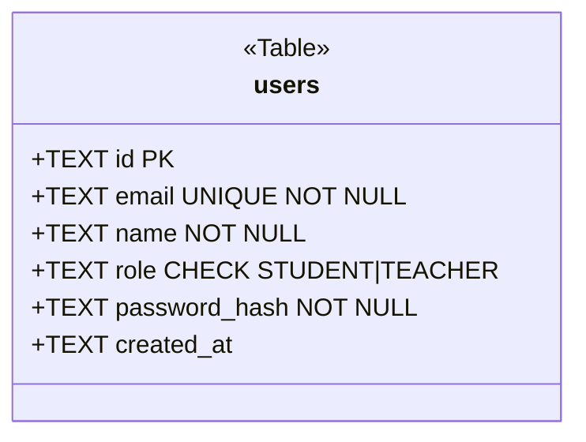

# Database UML: `auth.db`

```mermaid
classDiagram
    class users {
        <<Table>>
        +TEXT id PK
        +TEXT email UNIQUE NOT NULL
        +TEXT name NOT NULL
        +TEXT role CHECK STUDENT|TEACHER
        +TEXT password_hash NOT NULL
        +TEXT created_at
    }
```

Other services reference a user only by `users.id` (a plain text value inside a signed token). There are no foreign keys across databases.
