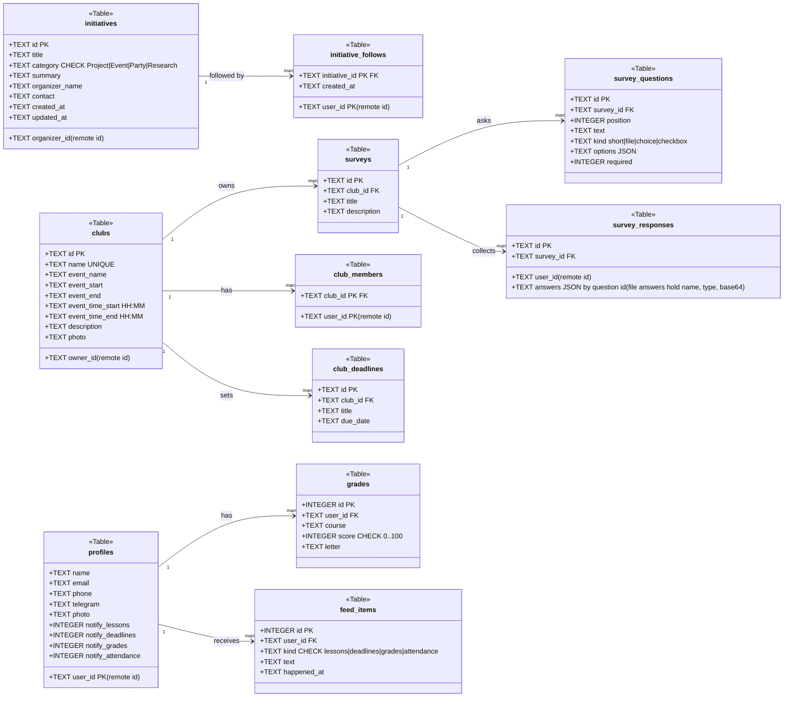

# Database UML: `social.db`

```mermaid
classDiagram
    direction LR
    class initiatives {
        <<Table>>
        +TEXT id PK
        +TEXT title
        +TEXT category CHECK Project|Event|Party|Research
        +TEXT summary
        +TEXT organizer_id  (remote id)
        +TEXT organizer_name
        +TEXT contact
        +TEXT created_at
        +TEXT updated_at
    }
    class initiative_follows {
        <<Table>>
        +TEXT initiative_id PK FK
        +TEXT user_id PK  (remote id)
        +TEXT created_at
    }
    class clubs {
        <<Table>>
        +TEXT id PK
        +TEXT name UNIQUE
        +TEXT owner_id  (remote id)
        +TEXT event_name
        +TEXT event_start
        +TEXT event_end
        +TEXT event_time_start  HH:MM
        +TEXT event_time_end  HH:MM
        +TEXT description
        +TEXT photo
    }
    class surveys {
        <<Table>>
        +TEXT id PK
        +TEXT club_id FK
        +TEXT title
        +TEXT description
    }
    class survey_questions {
        <<Table>>
        +TEXT id PK
        +TEXT survey_id FK
        +INTEGER position
        +TEXT text
        +TEXT kind  short|file|choice|checkbox
        +TEXT options  JSON
        +INTEGER required
    }
    class survey_responses {
        <<Table>>
        +TEXT id PK
        +TEXT survey_id FK
        +TEXT user_id  (remote id)
        +TEXT answers  JSON by question id (file answers hold name, type, base64)
    }
    class club_members {
        <<Table>>
        +TEXT club_id PK FK
        +TEXT user_id PK  (remote id)
    }
    class club_deadlines {
        <<Table>>
        +TEXT id PK
        +TEXT club_id FK
        +TEXT title
        +TEXT due_date
    }
    class profiles {
        <<Table>>
        +TEXT user_id PK  (remote id)
        +TEXT name
        +TEXT email
        +TEXT phone
        +TEXT telegram
        +TEXT photo
        +INTEGER notify_lessons
        +INTEGER notify_deadlines
        +INTEGER notify_grades
        +INTEGER notify_attendance
    }
    class grades {
        <<Table>>
        +INTEGER id PK
        +TEXT user_id FK
        +TEXT course
        +INTEGER score CHECK 0..100
        +TEXT letter
    }
    class feed_items {
        <<Table>>
        +INTEGER id PK
        +TEXT user_id FK
        +TEXT kind CHECK lessons|deadlines|grades|attendance
        +TEXT text
        +TEXT happened_at
    }
    initiatives "1" --> "many" initiative_follows : followed by
    clubs "1" --> "many" club_members : has
    clubs "1" --> "many" club_deadlines : sets
    clubs "1" --> "many" surveys : owns
    surveys "1" --> "many" survey_questions : asks
    surveys "1" --> "many" survey_responses : collects
    profiles "1" --> "many" grades : has
    profiles "1" --> "many" feed_items : receives
```
